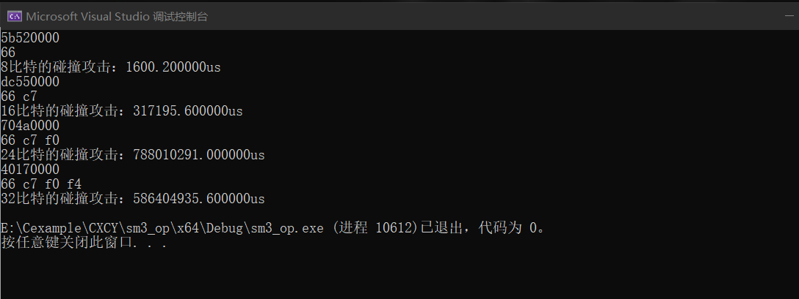

# project1 birthday attack
生日悖论是一种统计学现象，它指出在一个由23人组成的小组中，有50%的机会至少有两个人的生日是相同的。这似乎令人惊讶，但随着小组人数的增加，这个概率迅速增加。在一个50人的群体中，概率已经超过97%。生日攻击利用了这一统计特性，试图找到两个不同的输入信息，产生相同的哈希值。这被称为碰撞。如果攻击者能找到一个碰撞，他们就有可能欺骗系统，使其认为两个不同的信息是相同的。 

基于该理论，我们通过构造随机的信息，通过sm3计算其哈希值，通过与已知哈希值的前n比特进行对比，两组哈希值的前n比特相同则代表我们找到了一组碰撞。

## 代码说明
首先生成一个长度为8字节的随机信息，然后通过SM3计算其哈希值，通过memcmp函数对指定的前n比特数进行对比。若相同则输出碰撞的信息，碰撞的哈希值，若不同，则进入下一次迭代尝试，重新生成随机信息，重复上述步骤。
```cpp
void birthday_attack(unsigned char hash[], int n)
{
	while (1) {
		//生成随机数
		unsigned int min = 0;
		unsigned int max = -1;
		unsigned int temp = rand();
		unsigned int temp1 = rand();
		unsigned char tem[8];
		for (int i = 0; i < 4; i++)
		{
			tem[i] = temp & 0xff;
			temp = temp >> 8;
		}
		for (int i = 4; i < 8; i++)
		{
			tem[i] = temp1 & 0xff;
			temp1 = temp1 >> 8;
		}
		unsigned char tempHash[32];
		SM3_256(tem, 8, tempHash);
		if (memcmp(tempHash, hash, n / 8) == 0)
		{
			for (int n = 0; n < 4; n++)
				printf("%02x", tem[n]);
			printf("\n");
			for (int j = 0; j < n / 8; j++)
				printf("%02x ", tempHash[j]);
			break;
		}
	}
}
```

## 运行结果
可以看到，随着碰撞比特的增加，所花费的时间也越来越长，这是符合预期的。

