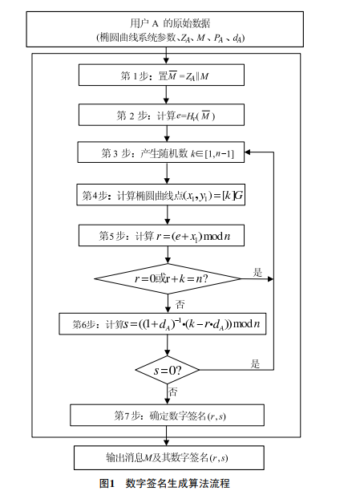
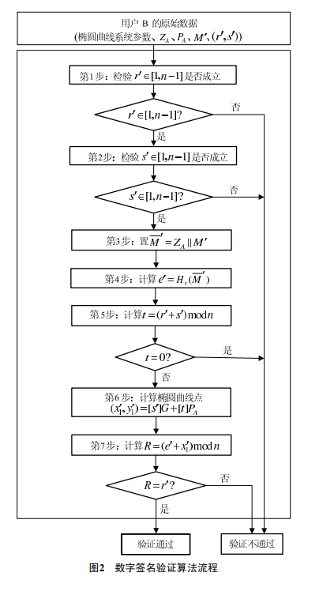
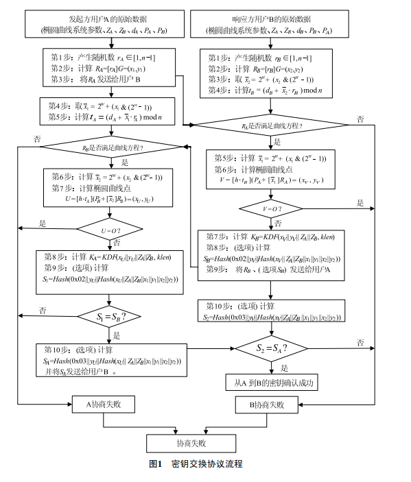
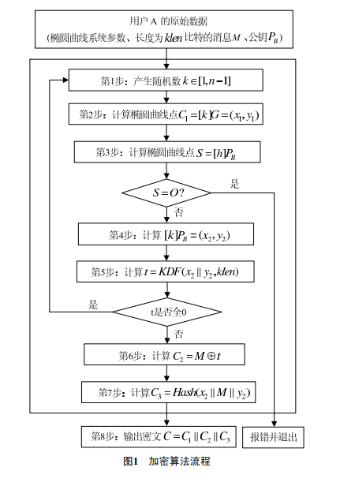
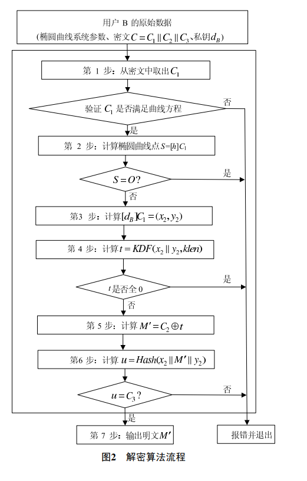
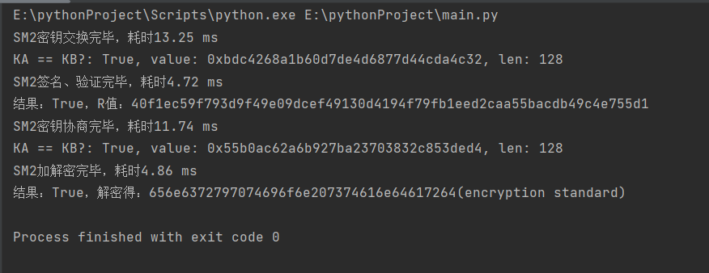

# project
## sm2简介
SM2为非对称加密，基于ECC。该算法已公开。由于该算法基于ECC，故其签名速度与秘钥生成速度都快于RSA。ECC 256位（SM2采用的就是ECC 256位的一种）安全强度比RSA 2048位高，但运算速度快于RSA。
旧标准的加密排序C1C2C3 新标准 C1C3C2，C1为65字节第1字节为压缩标识，这里固定为0x04，后面64字节为xy分量各32字节。C3为32字节。C2长度与原文一致。
SM2主要包括三部分：签名算法、密钥交换算法、加密算法。

## 签名算法
### 签名流程
- A1：置M=ZA ∥ M；
- A2：计算e = Hv(M)，将e的数据类型转换为整数；
- A3：用随机数发生器产生随机数k ∈[1,n-1]；
- A4：计算椭圆曲线点(x1,y1)=[k]G，将x1的数据类型转换为整数；
- A5：计算r=(e+x1) modn，若r=0或r+k=n则返回A3；
- A6：计算$`s= ((1 + dA)^{−1}· (k − r · dA)) (mod n)`$，若s=0则返回A3；
- A7：将r、s的数据类型转换为字节串，消息M 的签名为(r,s).

结构如下：  

#### 代码实现
```python
 def sign(self, M, k=None, outbytes=True, dohash=True) :
        if dohash :
            M_ = join_bytes ( [self.get_Z (), M] )
            e = to_int ( sm3 ( M_ ) )
        else :
            e = to_int ( to_byte ( M ) )
        while True :
            if not k :
                k = random.randint ( 1, self.n - 1 )
            # x1, y1 = self.multiply(k, self.G)
            x1, y1 = self.Jacb_multiply ( k, self.G )
            r = (e + x1) % self.n
            if r == 0 or r + k == self.n :
                k = 0
                continue
            # s = get_inverse(1 + self.sk, self.n) * (k - r * self.sk) % self.n
            s = self.d_1 * (k - r * self.sk) % self.n
            if s == 0 :
                k = 0
            else :
                break
        if outbytes :
            return to_byte ( (r, s), self.keysize )
        else :
            return r, s
```


### 验证流程
- B1:检验r′ ∈[1,n-1]是否成立，若不成立则验证不通过；
- B2:检验s′ ∈[1,n-1]是否成立，若不成立则验证不通过；
- B3:置M′=ZA ∥ M′；
- B4:计算e′ = Hv(M′)，将e′的数据类型转换为整数；
- B5:将r′、s′的数据类型转换为整数，计算t = (r′ + s′) modn，若t = 0，则验证不通过；
- B6:计算椭圆曲线点$`(x′_1, y′_1)=[s′]G + [t]PA`$；
- B7:将$`x′_1`$的数据类型转换为整数，计算$`R = (e′ + x′_1) modn`$，检验R=r′是否成立，若成立则验证通过；否则验证不通过。  

结构如下：  

#### 代码实现
```python
 def verify(self, M, sig, IDA, PA, dohash=True) :
        if isinstance ( sig, bytes ) :
            r = to_int ( sig[:self.keysize] )
            s = to_int ( sig[self.keysize :] )
        else :
            r, s = sig
        if not 1 <= r <= self.n - 1 :
            return False
        if not 1 <= s <= self.n - 1 :
            return False
        if dohash :
            M_ = join_bytes ( [self.get_Z ( IDA, PA ), M] )
            e = to_int ( sm3 ( M_ ) )
        else :
            e = to_int ( to_byte ( M ) )
        t = (r + s) % self.n
        if t == 0 :
            return False
        sG = self.Jacb_multiply ( s, self.G, False )
        tPA = self.Jacb_multiply ( t, PA, False )
        x1, y1 = self.Jacb_to_affine ( self.Jacb_add ( sG, tPA ) )
        R = (e + x1) % self.n
        if R == r :
            return True
        else :  # 避免Jacobian坐标下的等价点导致判断失败
            x1, y1 = self.add ( self.Jacb_to_affine ( sG ), self.Jacb_to_affine ( tPA ) )
            R = (e + x1) % self.n
            return R == r
```


## 密钥交换算法
密钥交换协议是两个用户A和B通过交互的信息传递，用各自的私钥和对方的公钥来商定一个只有他们知道的秘密密钥。这个共享的秘密密钥通常用在某个对称密码算法中。该密钥交换协议能够用于密钥管理和协商。  
SM2密钥交换算法的结构图如下：   

#### 代码实现
```python
  def agreement_response(self, RA, PA, IDA, option=False, rB=None, RB=None, klen=None) :
        # 参数准备
        if not self.on_curve ( RA ) :
            return False, 'RA不在椭圆曲线上'
        x1, y1 = RA
        w = math.ceil ( math.ceil ( math.log ( self.n, 2 ) ) / 2 ) - 1
        if not hasattr ( self, 'sk' ) :
            self.confirm_keypair ()
        h = 1  # SM2推荐曲线的余因子h=1
        ZA = self.get_Z ( IDA, PA )
        ZB = self.get_Z ()
        # B1-B7
        if not rB :
            rB, RB = self.gen_keypair ()
        x2, y2 = RB
        x_2 = (1 << w) + (x2 & (1 << w) - 1)
        tB = (self.sk + x_2 * rB) % self.n
        x_1 = (1 << w) + (x1 & (1 << w) - 1)
        # V = self.multiply(h * tB, self.add(PA, self.multiply(x_1, RA)))
        V = self.Jacb_multiply ( h * tB, self.Jacb_add ( self.Jacb_multiply ( x_1, RA, False ), PA ) )
        if self.is_zero ( V ) :
            return False, 'V是无穷远点'
        xV, yV = V
        if not klen :
            klen = KEY_LEN
        KB = KDF ( join_bytes ( [xV, yV, ZA, ZB] ), klen )
        if not option :
            return True, (RB, KB)
        # B8、B10（可选部分）
        tmp = join_bytes ( [yV, sm3 ( join_bytes ( [xV, ZA, ZB, x1, y1, x2, y2] ) )] )
        SB = sm3 ( join_bytes ( [2, tmp] ) )
        S2 = sm3 ( join_bytes ( [3, tmp] ) )
        return True, (RB, KB, SB, S2)

    # A 协商确认
    # SM2第3部分 6.1 A4-A10
    def agreement_confirm(self, rA, RA, RB, PB, IDB, SB=None, option=False, klen=None) :
        # 参数准备
        if not self.on_curve ( RB ) :
            return False, 'RB不在椭圆曲线上'
        x1, y1, x2, y2 = *RA, *RB
        w = math.ceil ( math.ceil ( math.log ( self.n, 2 ) ) / 2 ) - 1
        if not hasattr ( self, 'sk' ) :
            self.confirm_keypair ()
        h = 1  # SM2推荐曲线的余因子h=1
        ZA = self.get_Z ()
        ZB = self.get_Z ( IDB, PB )
        # A4-A8
        x_1 = (1 << w) + (x1 & (1 << w) - 1)
        tA = (self.sk + x_1 * rA) % self.n
        x_2 = (1 << w) + (x2 & (1 << w) - 1)
        # U = self.multiply(h * tA, self.add(PB, self.multiply(x_2, RB)))
        U = self.Jacb_multiply ( h * tA, self.Jacb_add ( self.Jacb_multiply ( x_2, RB, False ), PB ) )
        if self.is_zero ( U ) :
            return False, 'U是无穷远点'
        xU, yU = U
        if not klen :
            klen = KEY_LEN
        KA = KDF ( join_bytes ( [xU, yU, ZA, ZB] ), klen )
        if not option or not SB :
            return True, KA
        # A9-A10（可选部分）
        tmp = join_bytes ( [yU, sm3 ( join_bytes ( [xU, ZA, ZB, x1, y1, x2, y2] ) )] )
        S1 = sm3 ( join_bytes ( [2, tmp] ) )
        if S1 != SB :
            return False, 'S1 != SB'
        SA = sm3 ( join_bytes ( [3, tmp] ) )
        return True, (KA, SA)
```
## 加密算法
### 加密流程
- A1：用随机数发生器产生随机数k∈[1,n-1]；
- A2：计算椭圆曲线点C1=[k]G=(x1,y1)，将C1的数据类型转换为比特串；
- A3：计算椭圆曲线点S=[h]PB，若S是无穷远点，则报错并退出；
- A4：计算椭圆曲线点[k]PB=(x2,y2)，将坐标x2、y2 的数据类型转换为比特串；
- A5：计算t=KDF(x2 ∥ y2, klen)，若t为全0比特串，则返回A1；
- A6：计算C2 = M ⊕ t；
- A7：计算C3 = Hash(x2 ∥ M ∥ y2)；
- A8：输出密文C = C1 ∥ C2 ∥ C3。

结构图如下：  


#### 代码实现
```python
 def encrypt(self, M, PB, k=None) :
        if self.is_zero ( self.multiply ( self.h, PB ) ) :  # S
            return False, 'S是无穷远点'
        M = to_byte ( M )
        klen = get_bit_num ( M )
        while True :
            if not k :
                k = random.randint ( 1, self.n - 1 )
            # x2, y2 = self.multiply(k, PB)
            x2, y2 = self.Jacb_multiply ( k, PB )
            t = to_int ( KDF ( join_bytes ( [x2, y2] ), klen ) )
            if t == 0 :  # 若t为全0比特串则继续循环
                k = 0
            else :
                break
        # C1 = to_byte(self.multiply(k, self.G), self.keysize) # (x1, y1)
        C1 = to_byte ( self.Jacb_multiply ( k, self.G ), self.keysize )  # (x1, y1)
        C2 = to_byte ( to_int ( M ) ^ t, klen >> 3 )
        C3 = sm3 ( join_bytes ( [x2, M, y2] ) )
        return True, join_bytes ( [C1, C2, C3] )
```

## 解密算法
### 解密流程
- B1：从C中取出比特串C1，将C1的数据类型转换为椭圆曲线上的点，验证C1是否满足椭圆曲线方程，若不满足则报错并退出；
- B2：计算椭圆曲线点S=[h]C1，若S是无穷远点，则报错并退出；
- B3：计算[dB]C1=(x2,y2)，将坐标x2、y2的数据类型转换为比特串；
- B4：计算t=KDF(x2 ∥ y2, klen)，若t为全0比特串，则报错并退出；
- B5：从C中取出比特串C2，计算M′ = C2 ⊕ t；
- B6：计算u = Hash(x2 ∥ M′ ∥ y2)，从C中取出比特串C3，若u ̸= C3，则报错并退出；
- B7：输出明文M′。  

结构图如下：  


#### 代码实现
```python
    def decrypt(self, C) :
        x1 = to_int ( C[:self.keysize] )
        y1 = to_int ( C[self.keysize :self.keysize << 1] )
        C1 = (x1, y1)
        if not self.on_curve ( C1 ) :
            return False, 'C1不满足椭圆曲线方程'
        if self.is_zero ( self.multiply ( self.h, C1 ) ) :  # S
            return False, 'S是无穷远点'
        # x2, y2 = self.multiply(self.sk, C1)
        x2, y2 = self.Jacb_multiply ( self.sk, C1 )
        klen = len ( C ) - (self.keysize << 1) - HASH_SIZE << 3
        t = to_int ( KDF ( join_bytes ( [x2, y2] ), klen ) )
        if t == 0 :
            return False, 't为全0比特串'
        C2 = C[self.keysize << 1 :-HASH_SIZE]
        M = to_byte ( to_int ( C2 ) ^ t, klen >> 3 )
        u = sm3 ( join_bytes ( [x2, M, y2] ) )
        C3 = C[-HASH_SIZE :]
        if u != C3 :
            return False, 'u != C3'
        return True, M
```
## 运行结果
运行结果如下图，可以看到，成功实现了SM2算法的密钥交换、签名、加解密功能。  

