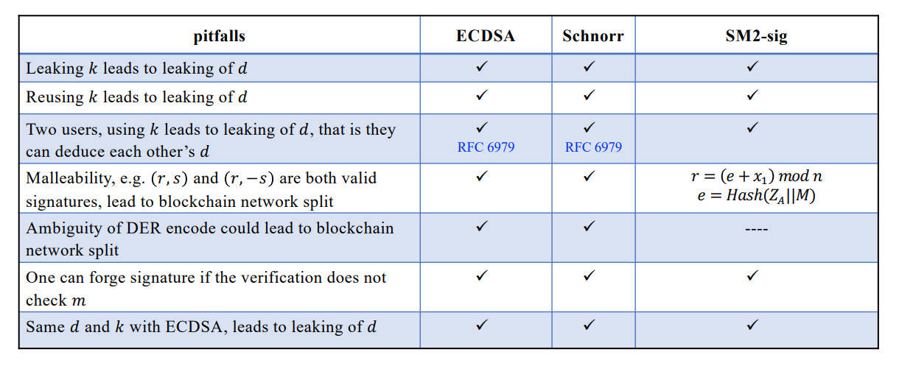
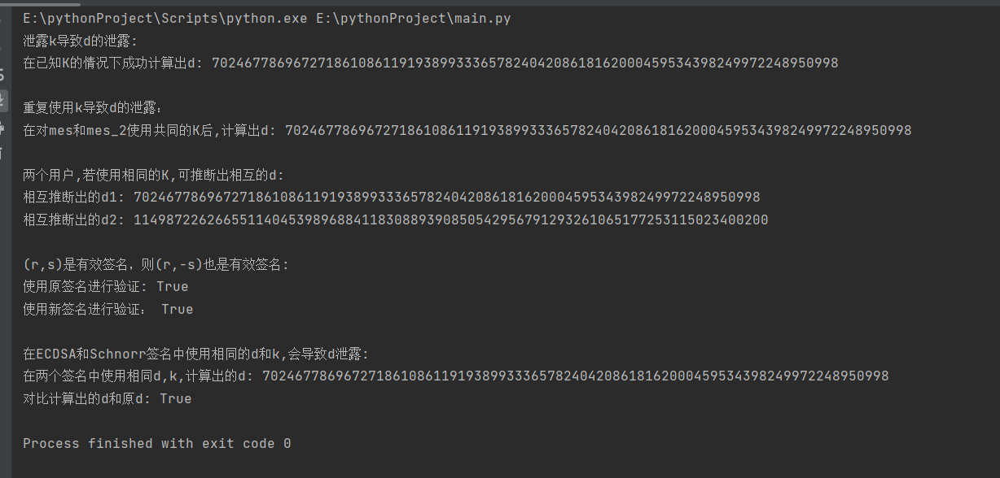

#  project12

## 验证内容
本项目需要验证内容如下图所示：  
  
具体实现了如下内容：  
- 泄露k导致d的泄露
- 重复使用k导致d的泄露
- 两个用户,若使用相同的K,可推断出相互的d
- (r,s)是有效签名，则(r,-s)也是有效签名
- 在ECDSA和Schnorr签名中使用相同的d和k,会导致d泄露

## 泄露k导致d的泄露
如果攻击者能够获取到两个不同的消息 m1 和 m2 对应的签名 (s1, r1) 和 (s2, r2)，同时还能够获取到对应的随机数 k1 和 k2，那么攻击者可以通过计算得到私钥 d。  
具体计算如下：  
- 计算两个消息的哈希值：e1 = H(m1) 和 e2 = H(m2)；
- 根据 s1、r1、k1 和 e1 的值计算出私钥 d1；
- 根据 s2、r2、k2 和 e2 的值计算出私钥 d2；
- 如果 d1 = d2，则攻击者成功获取到私钥 d。
### 代码实现
```python
def loss_k_loss_d(mes,s,r,K,n,e):
    r_inv = libnum.invmod(r, n)
    d = r_inv * (K * s - e) % n
    print('在已知K的情况下成功计算出d:',d,'\n')
```
## 重复使用k导致d的泄露
如果相同的随机数 K 被用于签名不同的消息，攻击者可以通过计算导出私钥 d。
具体计算如下：  
- 计算第一个消息的哈希值：e = H(mes)；
- 计算第二个消息的哈希值：e_2 = H(mes_2)；
- 根据 s、r、K 和 e 的值计算第一个消息对应的私钥 d；
- 根据 s_2、r2、K 和 e_2 的值计算第二个消息对应的私钥 d_2；
- 如果 d = d_2，则攻击者成功获取到私钥 d。  
### 代码实现
```python
def reuse_k_loss_d(sk,K,n,e,r,s):
    mes_2=b'renhai'
    sign_2 = sk.sign(mes_2, k=K, hashfunc=hashlib.sha256)
    r2 = sign_2.hex()[:64]
    s_2 = sign_2.hex()[64:]
    e_2 = hashlib.sha256()
    e_2.update(mes_2)
    e_2 = int(e_2.hexdigest(), 16)
    s_2 = int(s_2, 16)
    r2 = int(r2, 16)
    d_2 = (s * e_2 - s_2 * e) * libnum.invmod(s_2 * r - s * r, n) % n  # libnum.invmod用于求逆元
    print('在对mes和mes_2使用共同的K后,计算出d:', d_2,'\n')
```
## 两个用户,若使用相同的K,可推断出相互的d
如果两个用户使用相同的随机数 K 来生成签名，这可能导致彼此之间推断出对方的私钥 d。这是因为在 ECDSA 签名算法中，私钥 d 可以通过已知的参数和数学计算来推断出来。  
具体计算如下：  
- 用户1使用私钥 d 和随机数 K 对消息进行签名，得到签名的参数 r 和 s；
- 用户2使用私钥 d2 和相同的随机数 K 对消息进行签名，得到签名的参数 r2 和 s2；
- 用户1通过计算可以推断出用户2的私钥 d2；
- 用户2通过计算可以推断出用户1的私钥 d1。  
### 代码实现
```python
def  two_k_loss_d(d,K,e,s,n):
    sk_2 = SigningKey.generate(curve=NIST256p) #用户2再生成一个d
    vk_2 = sk_2.verifying_key  # P的横坐标纵坐标级联
    mes_2 = b'renhai'
    sign_2 = sk_2.sign(mes_2, k=K, hashfunc=hashlib.sha256)
    r2 = sign_2.hex()[:64]
    s2 = sign_2.hex()[64:]
    e2 = hashlib.sha256()
    e2.update(mes_2)
    e2 = int(e2.hexdigest(), 16)
    s2 = int(s2, 16)
    r2 = int(r2, 16)
    d2 = (s2 * e - s * e2 + s2 * r * d) * libnum.invmod(s * r, n) % n
    d1 = (s * e2 - s2 * e + s * r * d2) * libnum.invmod(s2 * r, n) % n
    print('相互推断出的d1:',d1)
    print('相互推断出的d2:',d2,'\n')
```
## (r,s)是有效签名，则(r,-s)也是有效签名
对于签名参数 (r, -s)，可以通过替换其中的 s 为 -s 后进行验证。
具体计算如下：
- 将 s 取反得到 -s；
- 将 -s 表示为十六进制形式，并进行相应的处理；
- 将原签名的 r 和新的 s_2（即 -s 的十六进制表示）进行级联得到新的签名 sign_2；
- 将 sign_2 转换为字节数组后，使用 vk.verify(sign_2, mes, hashfunc=hashlib.sha256) 进行验证。
### 代码实现
```python
def  rs_rs(s,sign,vk,mes):
    s_2 = -s % n
    s_2 = hex(s_2)[2:]
    if len(s_2) % 2:
        s_2 = '0' + s_2
    sign_2 = sign.hex()[:64] + s_2
    sign_2 = binascii.unhexlify(sign_2)
    print('使用原签名进行验证:',vk.verify(sign, mes, hashfunc=hashlib.sha256))
    print('使用新签名进行验证：',vk.verify(sign_2, mes, hashfunc=hashlib.sha256),'\n')


```
## 在ECDSA和Schnorr签名中使用相同的d和k,会导致d泄露
可以通过对 ECDSA 和 Schnorr 签名算法的计算过程进行逆向推导，计算出私钥 d 的近似值$`d_1`$。  
具体计算如下：
- 根据公式 (K * G).to_bytes() 将公钥 K 与曲线生成器 G 相乘，并将结果转换为字节表示；
- 对 K * G 和消息 mes 进行 SHA-256 哈希运算，得到哈希值 e_1；
- 根据公式 (K + e_1 * d) % n 计算出 ECDSA 的签名参数 s_1；
- 利用 Schnorr 签名的公式 (s * s_1 - e) * libnum.invmod(s * e_1 + r, n) % n，将已知的签名参数 s、r 和哈希值 e 带入，计算出近似的私钥 d_1；
- 对比计算得到的 d_1 和原始的私钥 d，如果相等，则说明通过使用相同的私钥和随机数计算得到的私钥 d 泄露。
### 代码实现
```python
def ecdsa_schnorr(d,sk,mes,K,n,s,r,e):
    G = sk.curve.generator
    e_1 = int(hashlib.sha256((K * G).to_bytes() + mes).hexdigest(), 16)
    s_1 = (K + e_1 * d) % n
    d_1 = (s * s_1 - e) * libnum.invmod(s * e_1 + r, n) % n
    print('在两个签名中使用相同d,k,计算出的d:',d_1)
    print('对比计算出的d和原d:',d_1 == d)
```
## 运行结果


