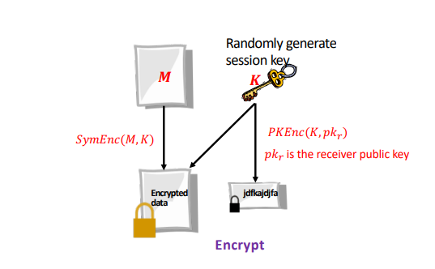
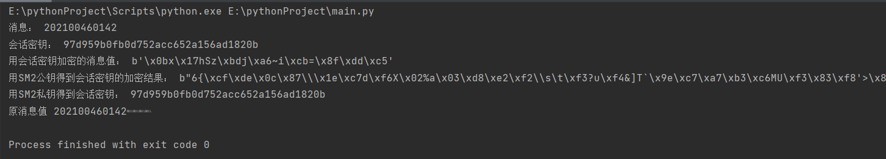

# project14
## PGP简介
Pretty Good Privacy (PGP) 是一种广泛使用的加密和数字签名软件，用于保护通信内容的机密性、完整性和认证性。
PGP 使用混合加密算法，结合了对称密钥加密和公钥加密的优势。具体来说，PGP 使用对称加密算法（如 AES）来加密通信内容，并使用公钥加密算法（本项目使用sm2实现）来保护对称密钥的安全传输。这样，只有拥有正确私钥的接收方才能解密对称密钥，并使用该对称密钥解密通信内容。除了加密通信内容，PGP 还提供了数字签名功能，用于确保通信内容的完整性和认证性。发送方使用私钥对消息进行签名，接收方可以使用发送方的公钥验证签名的有效性，并确认消息未被篡改。PGP 还包括密钥管理功能，可以生成和管理公钥和私钥对。每个用户都有自己的密钥对，其中私钥保密存储，而公钥可以与他人共享以实现加密通信。

## 加密实现
加密流程：  
- 生成密钥对：首先，用户需要生成自己的密钥对。密钥对由一个私钥和一个相关的公钥组成。私钥用于加密和签名，而公钥则用于解密和验证签名。
- 获取对方公钥：如果要发送加密消息给某人，你需要获取他们的公钥。你可以通过直接请求对方的公钥，或者通过密钥服务器等方式获取。
- 加密消息：使用sm2进行解密，生成一个随机的对称密钥。然后，使用对方的公钥对该对称密钥进行加密。该对称密钥将用于加密消息内容，以提供更高效的加密性能。
- 发送加密消息：将加密的消息和（可选的）数字签名发送给接收方。  
如下图所示：  

### 代码实现
```python
def PGP_Encrypt(mes, k):
    mode = AES.MODE_OFB
    iv = b'0000000000000000'
    cryptor = AES.new(k.encode('utf-8'), mode, iv)
    length = 16
    count = len(mes)
    if count % length != 0:
        add = length - (count % length)
    else:
        add = 0
    mes = mes + ('\0' * add)
    ciphertext1 = cryptor.encrypt(mes.encode('utf-8'))
    plaintext_bytes = k.encode('utf-8')
    ciphertext2 = SM2_enc(plaintext_bytes)
    print("用会话密钥加密的消息值：", ciphertext1)
    print("用SM2公钥得到会话密钥的加密结果：", ciphertext2)
    return ciphertext1, ciphertext2

```

## 解密实现
解密流程：
- 获取公钥、私钥
- 使用私钥解密对称密钥：使用自己的私钥解密加密消息中对称密钥的加密版本。这将提取出对称密钥，用于后续解密过程。
- 使用对称密钥解密消息：使用解密得到的对称密钥对加密消息内容进行解密。这样，接收方就可以获取原始的消息内容。
- 验证数字签名（可选）：如果加密的消息包含数字签名，接收方可以使用发件人的公钥来验证签名的有效性，并确认消息的完整性和认证性。
如下图所示：  

### 代码实现
```python
def PGP_Decrypt(mes1, mes2):
    mode = AES.MODE_OFB
    iv = b'0000000000000000'
    get_key = SM2_dec(mes2)
    print("用SM2私钥得到会话密钥：", get_key.decode('utf-8'))
    cryptor = AES.new(get_key, mode, iv)
    plain_text = cryptor.decrypt(mes1)
    print("原消息值", plain_text.decode('utf-8'))

```
## 运行结果

