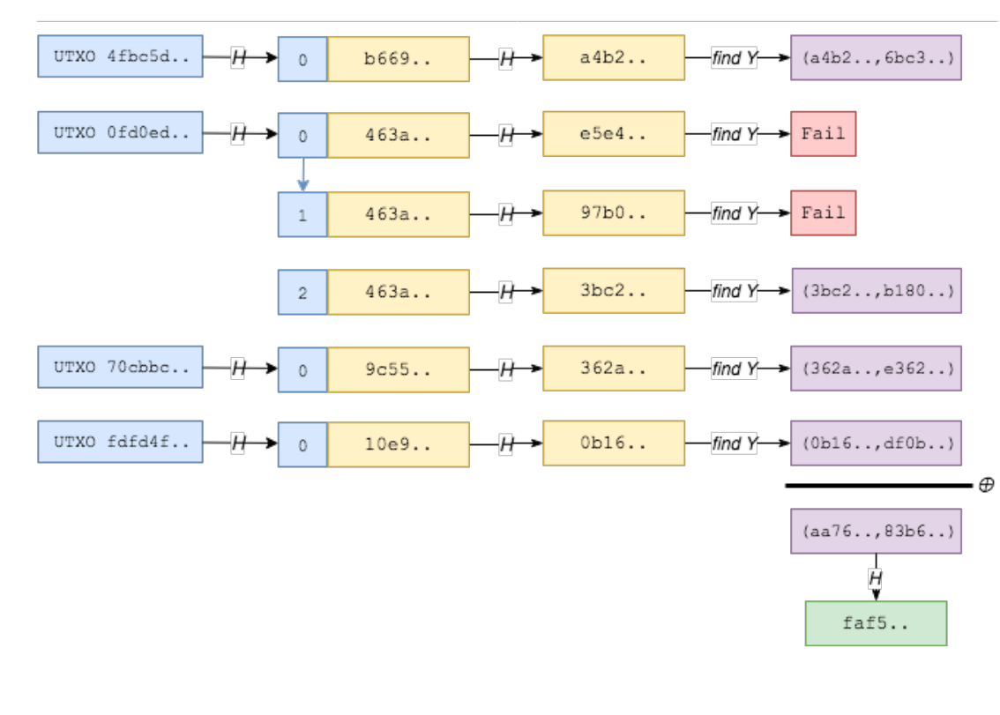

# project14

## ECMH
ECMH(Elliptic curve MultiSet Hash)是一种基于椭圆曲线的哈希算法。EMH的核心思想是利用椭圆曲线加法和乘法运算结合数据的多重集合特性进行哈希计算。它首先将消息进行分块处理，然后将每个块映射到一个椭圆曲线上的点。这些点被视为多重集合中元素的位置，然后使用特定的点运算来计算所有点的累积结果，最后将该结果转换为哈希值。并通过累计加法运算来确定哈希结果ECMH比一般的哈希求和算法要安全。多重哈希求和结构如下图所示:  

## 代码实现
仅展示核心代码
```python
def SM2_Mulyipoint(k, P, a, p):  # 返回值R = k*P , P为椭圆曲线上的一点 , k为正整数
    k_b = bin(k).replace('0b', '')  # 按2^i分层逐层运算
    i = len(k_b) - 1
    R = P
    if i > 0:
        k = k - 2 ** i
        while i > 0:
            R = SM2_Pluspoint(R, R, a, p)
            i -= 1
        if k > 0:
            R = SM2_Pluspoint(R, SM2_Mulyipoint(k, P, a, p), a, p)
    return R
def SM2_Pluspoint(P, Q, a, p):  # 返回值R = P+Q , P、Q为椭圆曲线上的两点 , 加法运算为定义在椭圆曲线上的加法
    if (math.isinf(P[0]) or math.isinf(P[1])) and (~math.isinf(Q[0]) and ~math.isinf(Q[1])):  # OP = P
        R = Q
    elif (~math.isinf(P[0]) and ~math.isinf(P[1])) and (math.isinf(Q[0]) or math.isinf(Q[1])):  # PO = P
        R = P
    elif (math.isinf(P[0]) or math.isinf(P[1])) and (math.isinf(Q[0]) or math.isinf(Q[1])):  # OO = O
        R = [float('inf'), float('inf')]
    else:
        if P != Q:
            l = SM2__Mod_Decimal(Q[1] - P[1], Q[0] - P[0], p)
        else:
            l = SM2__Mod_Decimal(3 * P[0] ** 2 + a, 2 * P[1], p)
        x = SM2_Mod(l ** 2 - P[0] - Q[0], p)
        y = SM2_Mod(l * (P[0] - x) - P[1], p)
        R = [x, y]
    return R
def MultiSetHash(sett):  # 定义集合的哈希 sett: bytes型集合
    digest_value = [float("inf"), float("inf")]
    for i in sett:
        x = int(sm3.sm3_hash(func.bytes_to_list(i)), 16)
        temp = SM2_Mod(x ** 2 + a * x + b, p)
        y = Tonelli_Shanks(temp, p)
        digest_value = SM2_Pluspoint(digest_value, [x, y], a, p)
    return digest_value
```

## 运行结果

