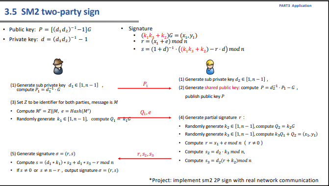
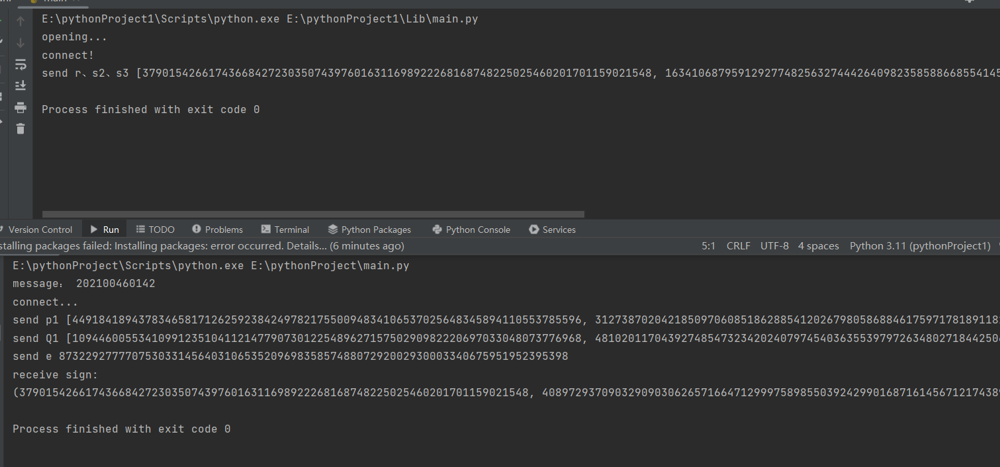

# project15
具体流程如下图所示：

## 代码实现
客户端
```python
def client():
    IDA = 0x414C494345313233405941484F4F2E434F4D
    msg = "202100460142"
    IDB = 0x414C494345313233405941484F4F2E434F4C
    HOST = "127.0.0.1"
    PORT = 5005
    P = 0, 0
    Ad1 = 0
    r, s2, s3 = 0, 0, 0
    k1 = 0
    s = 0
    print("message：",msg)
    print("connect...")
    def A_1():
        nonlocal Ad1
        Ad1 = random.randrange(1, n)
        P1 = calculate_np(Gx, Gy, Ad1, a, b, p)
        return P1

    def A_3():
        nonlocal k1
        M = msg.encode()
        ENTLA = get_bitsize(IDA) * 8
        ENTLB = get_bitsize(IDB) * 8
        data = ENTLA.to_bytes(2, byteorder='big', signed=False) + int_to_bytes(IDA) + ENTLB.to_bytes(2, byteorder='big',
                                                                                                     signed=False) + int_to_bytes(
            IDB) + int_to_bytes(a) + int_to_bytes(
            b) + int_to_bytes(Gx) + int_to_bytes(Gy) + int_to_bytes(P[0]) + int_to_bytes(P[1])
        ZA = int(sm3.sm3_hash(list(data)), 16)
        M_ = int_to_bytes(ZA) + M
        e = int(sm3.sm3_hash(list(M_)), 16)
        k1 = random.randrange(1, n)
        Q1 = calculate_np(Gx, Gy, k1, a, b, p)
        return Q1, e

    def A_5():
        nonlocal s
        s = ((Ad1 * k1) * s2 + Ad1 * s3 - r) % n

    s = socket.socket()  # 创建 socket 对象
    host = socket.gethostname()  # 获取本地主机名
    port = 12345  # 设置端口号

    s.connect((host, port))
    p1 = str(A_1())

    s.send(p1.encode())
    print("send p1",p1)
    P_str = s.recv(1024)
    P = json.loads(P_str.decode())
    Q1, e = A_3()
    s.send(str(Q1).encode())
    s.send(str(e).encode())
    print("send Q1", Q1)
    print("send e", e)
    msg = s.recv(1024)
    r, s2, s3 = json.loads(msg.decode())
    A_5()
    print("receive sign:")
    return r, s
```
服务器端
```python
def serve():
    Q1 = 0, 0
    e = 0
    Bd2 = 0
    r, s2, s3 = 0, 0, 0

    def  serve_1_2(P1):
        nonlocal Bd2
        Bd2 = random.randrange(1, n)
        P2 = calculate_np(P1[0], P1[1], get_inverse(Bd2, n), a, b, p)
        G_T = calculate_Tp(Gx, Gy, a, b, p)
        P = calculate_p_q(P2[0], P2[1], G_T[0], G_T[1], a, b, p)
        return P

    def  serve_4():
        nonlocal r, s2, s3
        k2 = random.randrange(1, n)
        Q2 = calculate_np(Gx, Gy, k2, a, b, p)
        k3 = random.randrange(1, n)
        temp = calculate_np(Q1[0], Q1[1], k3, a, b, p)
        x1, y1 = calculate_p_q(temp[0], temp[1], Q2[0], Q2[1], a, b, p)
        r = (x1 + e) % n
        s2 = (Bd2 * k3) % n
        s3 = (Bd2 * (r + k2)) % n

```
## 运行结果

