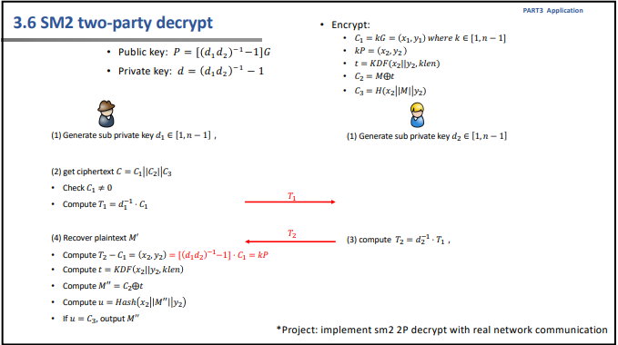
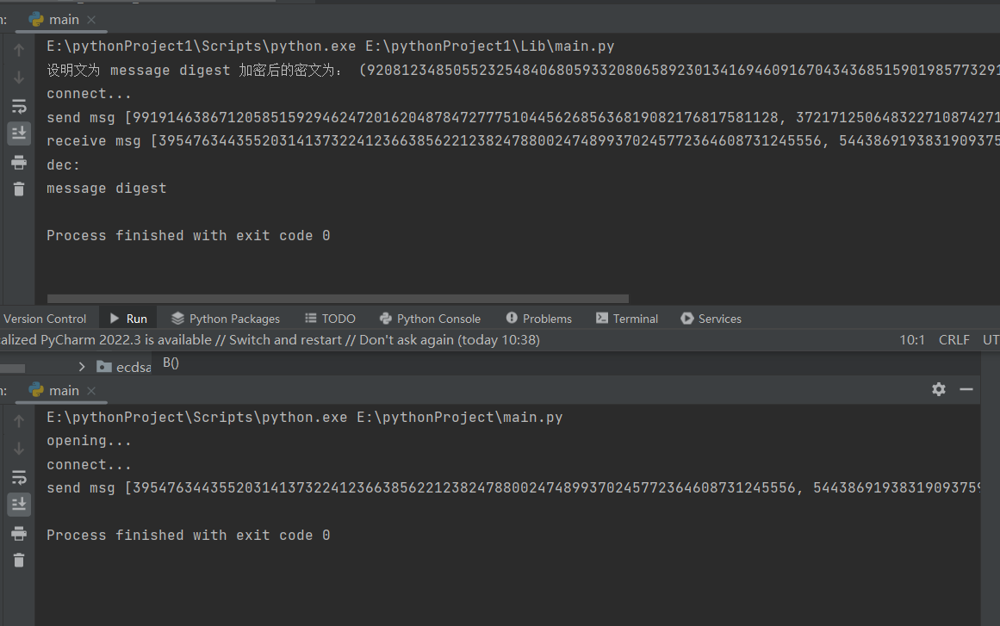

# project16
具体流程如下图所示：  

## 代码实现
客户端
```python
def client():
    msg = "message digest"

    C1, C2, C3 = [(9208123485055232548406805933208065892301341694609167043436851590198577329182,
                   22497156797805874980417938328502193624670699415281173926964553771202322035334),
                  428345813838056492794735501498020,
                  12159561144976371370304274003186071825317752572795393426538011957777595730391]
    print("设明文为", msg, "加密后的密文为：", C1, C2, C3)
    def client_1():
        d1 = 56978832327631670959038636096318190185559761644917797097344730557150433420452
        return d1

    def client_2(d1):
        x1,y1=C1
        T1=calculate_np(x1,y1,get_inverse(d1,n),a,b,p)
        return T1

    def client_4(T2):
        C1_T=calculate_Tp(C1[0],C1[1],a,b,p)
        (x2,y2)=calculate_p_q(T2[0],T2[1],C1_T[0],C1_T[1],a,b,p)
        num = int_to_bytes(x2) + int_to_bytes(y2)
        klen = len(msg.encode()) * 8
        t = KDF(num, klen)
        M=C2^t
        temp = int_to_bytes(x2) + int_to_bytes(M) + int_to_bytes(y2)
        u = int(sm3.sm3_hash(list(temp)), 16)
        if u == C3:
            return int_to_bytes(M).decode()

    print("connect...")
    s = socket.socket()  # 创建 socket 对象
    host = socket.gethostname()  # 获取本地主机名
    port = 12345  # 设置端口号
    s.connect((host, port))
    d1 = client_1()
    T1=str(client_2(d1))
    s.send(T1.encode())
    print("send msg", T1)
    T2_str = s.recv(1024)
    T2 = json.loads(T2_str.decode())
    print("receive msg",T2)
    print("dec:")
    print(client_4(T2))

```
服务器端
```python
def serve():
    Q1 = 0, 0
    e = 0
    Bd2 = 0
    r, s2, s3 = 0, 0, 0

    def serve_1():
        d2 = 37924224460188212696442974290998605142121773550747161941364380535096233845372
        return d2

    def serve_3(d2,T1):
        return calculate_np(T1[0],T1[1],get_inverse(d2,n),a,b,p)

    s = socket.socket()  # 创建 socket 对象
    host = socket.gethostname()  # 获取本地主机名
    port = 12345  # 设置端口
    s.bind((host, port))  # 绑定端口
    print("opening...")
    s.listen(5)  # 等待客户端连接
    c, addr = s.accept()  # 建立客户端连接
    print("connect...")
    T1_str = c.recv(1024)
    T1 = json.loads(T1_str.decode())
    d2=serve_1()
    T2 = str(serve_3(d2,T1))
    c.send(str(T2).encode())
    print("send msg",T2 )
```
## 运行结果


