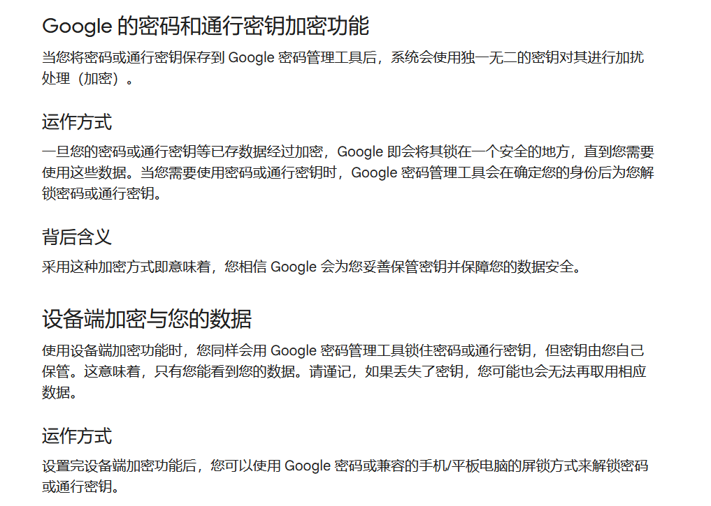
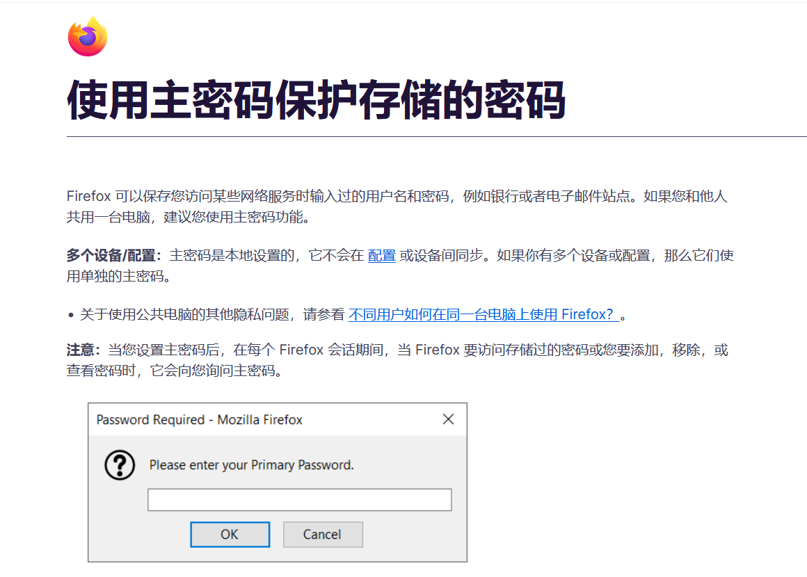
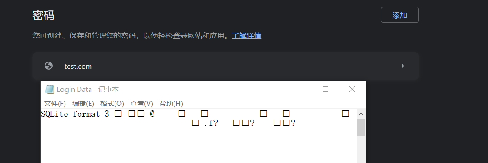
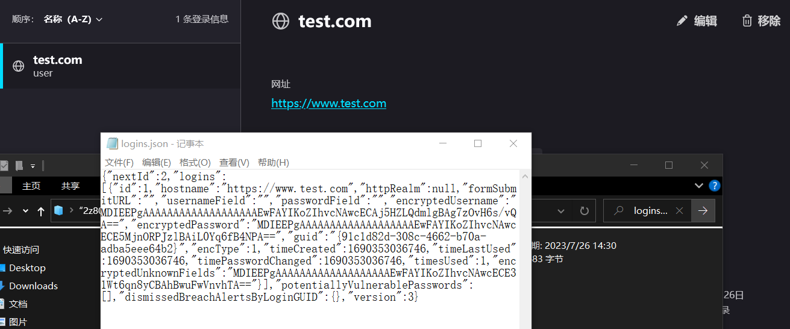

# project17
## 密码管理方式不同
Firefox与Google的密码管理器实现有所不同：  
对于Google:  
Google会将密码锁在一个安全的地方，当将密码或通行密钥保存到 Google 密码管理工具后，系统会使用独一无二的密钥对其进行加扰处理（加密）。直到需要使用这些数据。当需要使用密码或通行密钥时，Google 密码管理工具会在确定您的身份后为您解锁密码或通行密钥。

对于Firefox:  
Firefox可以使用一个主密码对所保存的信息进行保护，其中主密码是本地配置，不同设备间不会同步。  

## 信息存储方式不同
对于Google:  
Google的密码存储在Login Data文件中，我们可以根据一下路径进行查找"C:\Users\<Your-Username>\AppData\Local\Google\Chrome\User Data\Default\Login Data
"打开后我们看到的只是一团乱码

对于Firefox:  
Firefox的密码存储在logins.json文件中，我们可以根据以下路劲进行查找"C:\Users\<Your-Username>\AppData\Roaming\Mozilla\Firefox\Profiles\<Profile-Folder>\logins.json
"打开后我们能阅读出一些信息

## 总结
Firefox与Google在记住密码的插件实现诸多不同。总的来说，使用Google进行记住密码会更为安全，通过直接阅读Login Data文件并不会泄露任何有用的信息。
