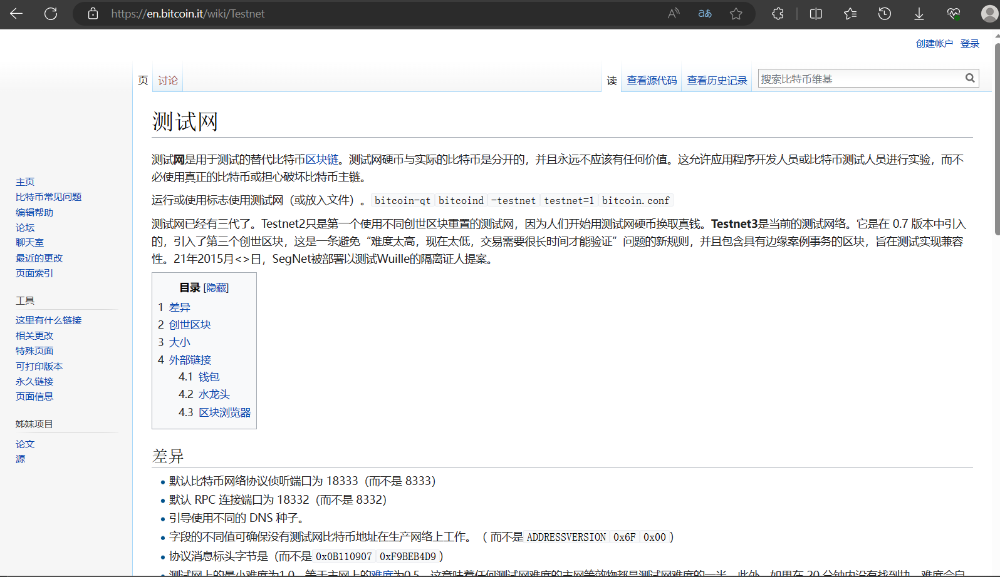

# project18
## send a tx on Bitcoin testnet
首先找到一个比特币测试网（这里选取的网址为：[https://en.bitcoin.it/wiki/Testnet](https://en.bitcoin.it/wiki/Testnet)）,然后自写脚本发送信息至网站

## 返回结果

从中我们可以读取返回的的信息

## 在实际网站访问一笔交易
在[https://www.blockchain.com](https://www.blockchain.com)上选取一笔交易信息，编写脚本，读取交易的信息

## 返回结果


## 编写的脚本
```python
from requests_html import HTMLSession
import  requests

session = HTMLSession()
url = 'https://www.blockchain.com/explorer/transactions/btc/94a93ba7d3a8729edc4a48139edf117e4abb0929c746daae7c08e8e16b66f7ff'
response = session.get(url)
print(response.html.full_text)

url='https://en.bitcoin.it/wiki/Testnet'
tx="202100460142"
print("发送的tx信息为：",tx)
post_html=requests.post(url,data=tx)
print("响应的信息为：")
print(post_html.text)
```
