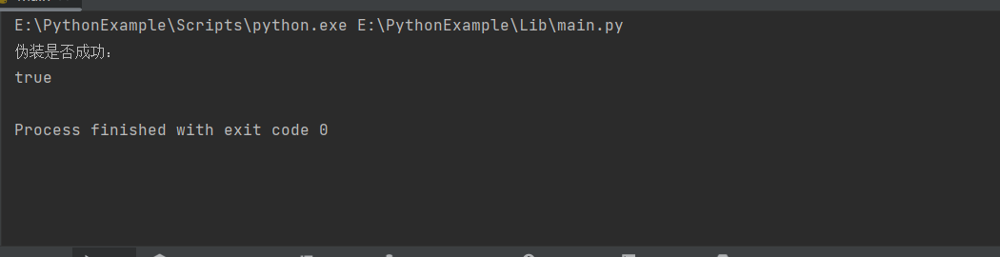

 # project 19
 ## 算法简介
 ECDSA（Elliptic Curve Digital Signature Algorithm，椭圆曲线数字签名算法）是一种公钥密码学中常用的数字签名算法，用于确保数据的完整性、身份验证和防止伪造。ECDSA主要基于椭圆曲线离散对数问题（Elliptic Curve Discrete Logarithm Problem，ECDLP）的难解性，该问题在计算复杂度上是极其困难的。因此，ECDSA算法的安全性依赖于选取合适的椭圆曲线参数和密钥长度。

密钥生成：

- 选择一个椭圆曲线作为基础，该椭圆曲线应该公开并被接受。
- 在选定的椭圆曲线上选择一个基点，该基点的阶数（order）应该是一个大素数，同时确定一个生成元。
- 随机生成一个私钥（私钥为一串随机数）。
- 计算出公钥，公钥是基点乘以私钥得到的点。

签名过程：

- 选择一个消息，并计算其哈希值。
- 随机生成一个值k，它应该在一定的范围内，并且每次签名使用不同的k值。
- 通过k值计算出一个临时点，然后取该点的x坐标作为签名的一部分。
- 根据临时点的x坐标、私钥和哈希值计算出另一个值，这个值作为签名的另一部分。

验证过程：

- 对接收到的签名进行解析。
- 使用发送方的公钥、哈希值以及签名的两个部分进行验证。
- 如果验证通过，说明签名是有效的，并且可以确定发送方的身份。

## 攻击原理
若验证者不检查签名邮件，则可以利用椭圆曲线的加法性质和Gcd函数的特性，通过选择合适的u和v，可以构造出一个点Q，使得Q = uG + vP。然后根据Q的坐标计算出伪造的签名(r', s')，并将其传递给验证函数进行验证。

## 代码实现
```python
def Verify_without_m(e, n, G, r, s, P):
    w = Gcd(s, n)
    v1 = (e * w) % n
    v2 = (r * w) % n
    w = Add(Multiply(v1, G), Multiply(v2, P))
    if (w == 0):
        print('false')
        return False
    else:
        if (w[0] % n == r):
            print('true')
            return True
        else:
            print('false')
            return False

def Pretend(r, s, n, G, P):
    u = random.randrange(1, n - 1)
    v = random.randrange(1, n - 1)
    r1 = Add(Multiply(u, G), Multiply(v, P))[0]
    e1 = (r1 * u * Gcd(v, n)) % n
    s1 = (r1 * Gcd(v, n)) % n
    Verify_without_m(e1, n, G, r1, s1, P)
```

## 运行结果
如下图所示，在不检查消息签名的情况下，我们成功的实现了伪装。  

