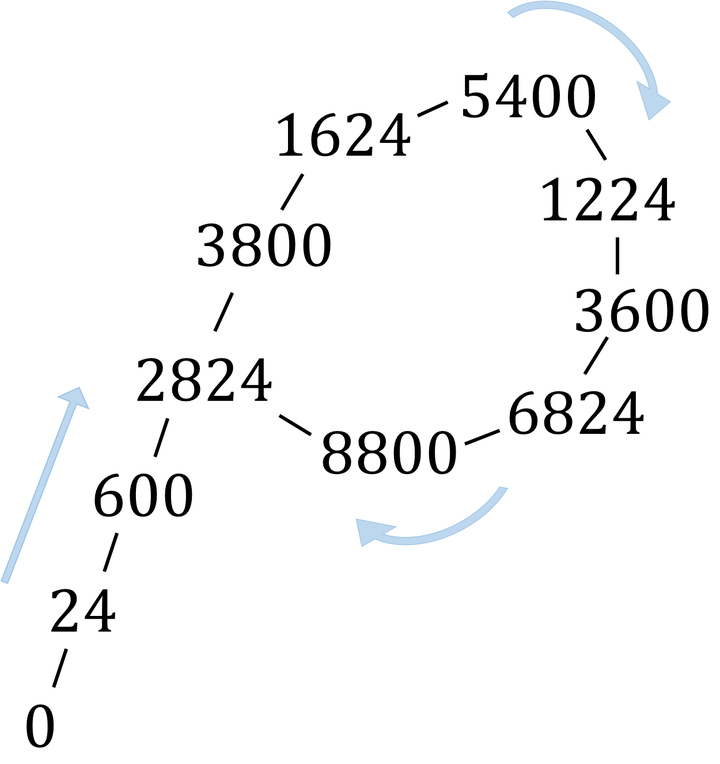
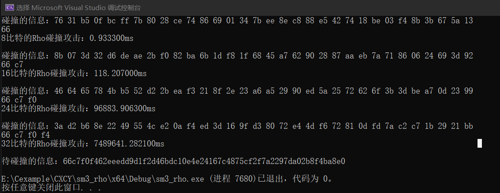

# project2
Pollard-Rho算法是John Pollard发明的一种能快速找到大整数的一个非1、非自身的因子的算法。基于该算法，我们可以，通过递归生成伪随机序列，计算其中元素的哈希值，其中每一个元素的都是前一个元素的哈希值。因为每个数都是由前一个数决定的，可以生成的数又是有限的，那么迟早会进入循环。（如下图）  
<div align=center></div>

## 代码实现
首先随机初始一个32字节的信息，计算其哈希值，判断其哈希值的前n比特是否与给定的哈希值前n比特相同，若不同，则以该哈希为初值，计算哈希的哈希，进行下一轮比较，直到找到一组碰撞为止。
```cpp
void Rho(unsigned char hash[], int n)
{
	unsigned char tem[32];//随机初始一个值
	for (int i = 0; i < 8; i++)
	{
		unsigned int temp = rand();
		for (int j = 0; j < 4; j++)
		{
			tem[i*4+j] = temp & 0xff;
			temp = temp >> 8;
		}
	}
	unsigned char tempHash[32];
	SM3_256(tem, 32, tempHash);
	while (!memcmp(tempHash, hash, n / 8) == 0)
	{
		strcpy(tem, tempHash);
		SM3_256(tempHash, 32, tempHash);
	}
	printf("碰撞的信息：");
	for (int n = 0; n < 32; n++)
		printf("%02x ", tem[n]);
	printf("\n");
	for (int j = 0; j < n / 8; j++)
		printf("%02x ", tempHash[j]);
}

```
## 运行结果
同生日攻击一样，随着碰撞比特的增加，所消耗的时间也随之增加

