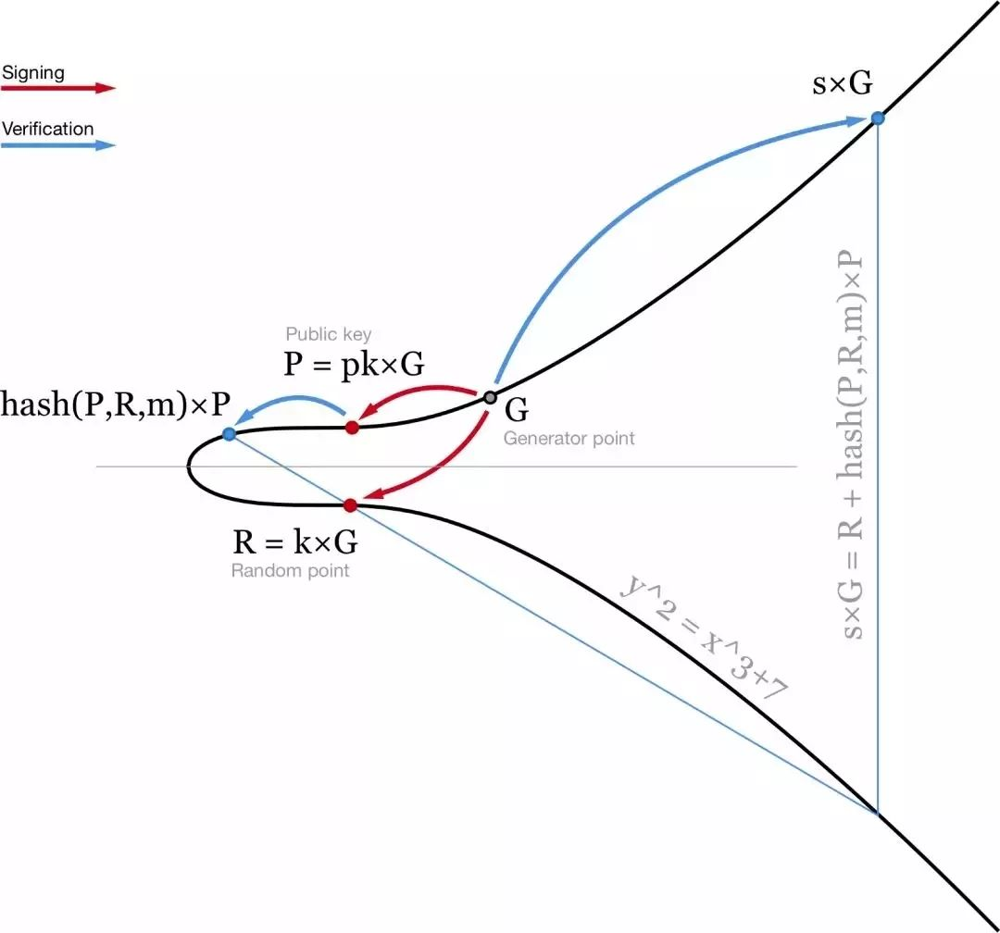
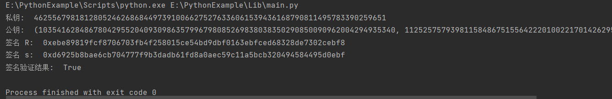

# project21

## Schnorr签名算法概述
Schnorr签名算法最初是由德国密码学家ClausSchnorr于2008年提出的，在密码学中，它是一种数字签名方案，以其简单高效著称 原理：其安全性基于某些离散对数问题的难处理性。 

如图所示，schnorr使用一个点 R 和一个标量s来代替两个标量（r，s）。与 ECDSA 相似的是，R 是椭圆曲线（R=K×G）上的一个随机点。签名的第二部分计算略有不同: s = k + hash(P,R,m) ⋅ pk。这里的 pk 是你的私钥，而P = pk×G 则是公钥，m 是消息。然后可通过检查 s×G = R + hash(P,R,m)×P 来验证这个签名。


## 基本步骤

- 密钥生成：首先，参与者生成一个私钥（随机数）和对应的公钥。私钥必须保密，而公钥可以公开。

- 签名生成：要对一条消息进行签名，使用私钥生成一个加密随机数，并基于随机数和消息计算出签名值。

- 签名验证：使用公钥、签名值和原始消息，验证签名的正确性。通过使用公钥重新计算签名值，并将其与接收到的签名值进行比较来进行验证。

## 优点

- 简洁性：相比其他签名算法（如RSA和ECDSA），Schnorr签名具有更短的签名长度，节省存储空间和传输成本。

- 安全性：Schnorr签名建立在数论的离散对数难题上，因为找到离散对数是困难的，所以Schnorr签名被认为是安全的。

- 可组合性：Schnorr签名是可组合的，意味着多个签名可以合并成一个单一的签名，这对于多方参与的复杂交互和协议非常有用。

## 代码实现
签名：  
```python
def sign_message(private_key, message) :
    # 生成随机数 k (k < n)
    k = random.randint ( 1, n - 1 )

    # 计算 R = k * G （椭圆曲线上的点）
    R = multiply ( k, (Gx, Gy) )

    # 将 x 坐标转换为整数
    R = bytes_to_int ( R[0].to_bytes ( 32, 'big' ) )

    # 计算 e = H(R, M)
    e = int ( hashlib.sha256 ( R.to_bytes ( 32, 'big' ) + message.encode () ).hexdigest (), 16 )

    # 计算 s = k - e * private_key mod n
    s = (k - e * private_key) % n

    return R, s
```
验证签名：
```python
def verify_signature(public_key, message, R, s) :
    # 计算 e = H(R, M)
    e = int ( hashlib.sha256 ( R.to_bytes ( 32, 'big' ) + message.encode () ).hexdigest (), 16 )

    # 计算 Q = s * G + e * public_key
    Q = add ( multiply ( s, (Gx, Gy) ), multiply ( e, public_key ) )

    # 将 x 坐标转换为整数
    Q = bytes_to_int ( Q[0].to_bytes ( 32, 'big' ) )

    # 验证 R == Q
    return R == Q
```

## 运行结果

