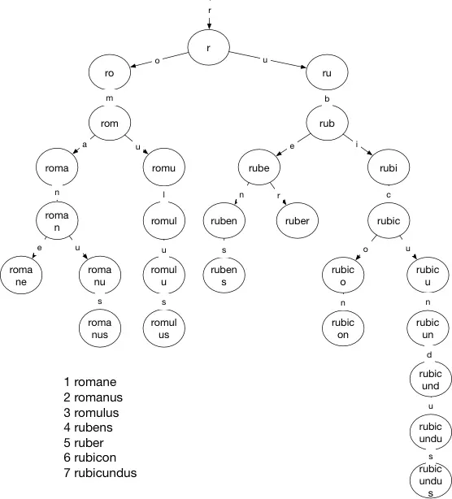
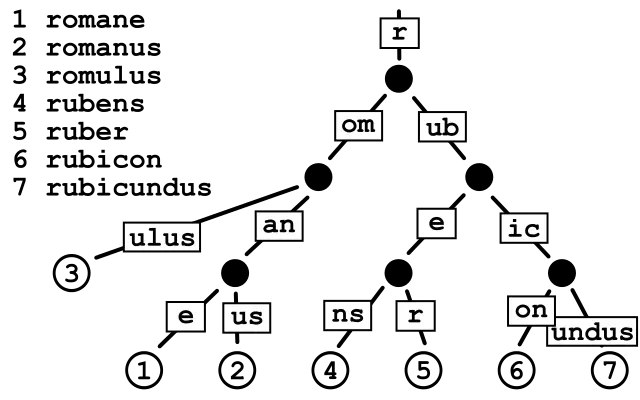
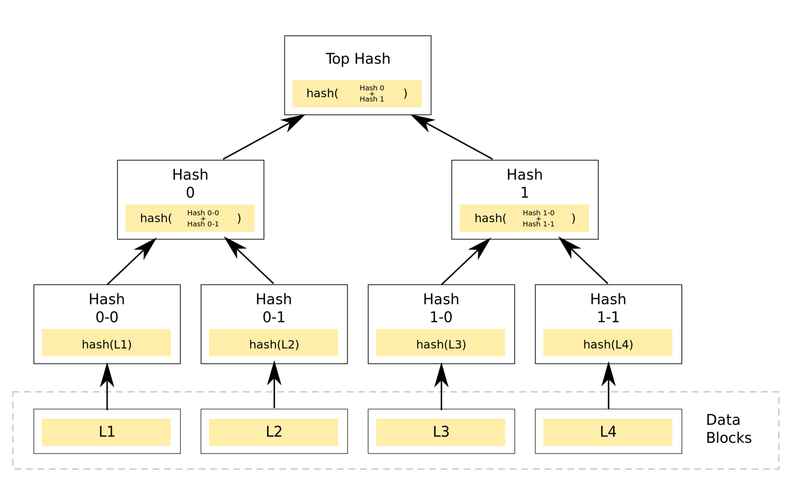
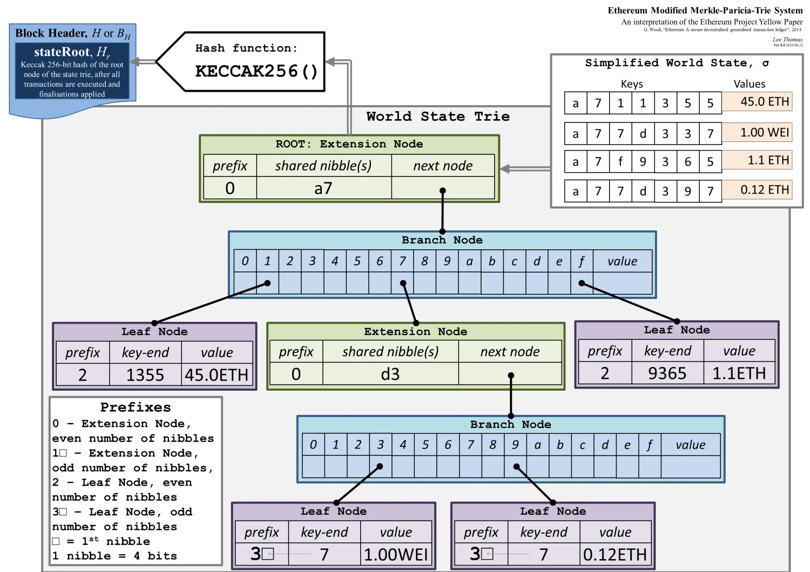

# project22

## 基础知识
### Trie树
Trie（也称为前缀树或字典树）是一种用于快速检索和存储字符串键值对的树状数据结构。它特别适用于处理字符串的前缀查找和匹配操作。  
Trie 树的基本思想是将字符串中的每个字符作为树的节点，通过连接这些节点来表示完整的字符串。从根节点到叶子节点的路径上形成的字符串就是存储在 Trie 中的键。  
    

### Patricia树
Patricia 树，也称为压缩前缀树或Radix树，是一种特殊的Trie树，用于高效地存储和检索字符串键值对。它通过合并共享相同前缀的节点来减少内存开销，并提高了搜索效率。  
与传统的Trie树不同，Patricia树在每个节点上存储了部分或全部的键值，而不是仅将字符存储在节点上。这样的设计使得Patricia树能够在每个节点上跳过具有唯一分支的中间节点，从而压缩结构并减少内存使用量。  

### Markle树
Merkle树（Merkle Tree），也被称为哈希树（Hash Tree），是一种树状数据结构，用于对大量数据进行高效的完整性验证。  
Merkle树的基本原理是通过对数据进行逐层哈希运算，将大量数据划分为多个块，并在每个节点上存储其对应块的哈希值。父节点的哈希值通过对子节点的哈希值进行哈希运算而得到，最终形成一个根节点，也即树的顶部节点。这个根节点的哈希值可以用作数据的完整性检验。  
通过Merkle树，可以高效地检测到数据的任何修改或篡改，而无需对整个数据集进行比较。只需验证根节点的哈希值是否与已知的摘要匹配即可确定数据的完整性。  
  

## 以太坊中的MPT
MPT树是一种经过改良的、融合了默克尔树和前缀树两种树结构优点的数据结构，Merkle Patricia 树是由 Merkle 树和 Patricia 树两种数据结构组合而成的。它通过在每个节点上使用键值对的方式来存储数据，并使用哈希值将节点连接起来。这种树结构允许以太坊在有限的存储空间内高效地存储大量的账户和合约状态信息。Merkle Patricia 树的设计旨在提供快速验证和检索状态的能力。通过使用哈希值，可以轻松地验证数据的完整性，即使数据集很大。此外，Merkle Patricia 树还具有很好的扩展性，可以在不同的节点中共享相同的子树，以节省存储空间和增加查询效率。在以太坊中，Merkle Patricia 树被广泛应用于账户和合约存储系统。它为以太坊提供了高效的账户状态验证、合约代码存储和数据检索功能。通过使用 Merkle Patricia 树，以太坊可以高效地管理大量的账户和合约，并实现快速的状态验证和更新。其主要结构可由下图表示：  

可以看到有四个状态要存储在世界状态的MPT树中，需要存入的值是键值对的形式。自顶向下，我们首先看到的keccak256生成的根哈希，参考默克尔树的Top Hash，其次看到的是绿色的扩展节点Extension Node，其中共同前缀shared nibble是a7，采用了压缩前缀树的方式进行了合并，接着看到蓝色的分支节点Branch Node，其中有表示十六进制的字符和一个value，最后的value是fullnode的数据部分，最后看到紫色的叶子节点leadfNode用来存储具体的数据，它也是对路径进行了压缩。
