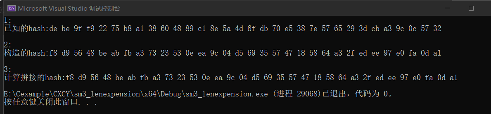

# project3
长度扩展攻击是指一种针对特定加密散列函数的攻击手段，攻击者可以利用H（消息1）和消息1的长度，不知道消息1内容的情形下，将攻击者控制的消息2计算出H（消息1 ‖ 消息2）。该攻击适用于在消息与密钥的长度已知的情形下，所有采取了 H(密钥 ∥ 消息) 此类构造的散列函数。


## 代码实现 
首先我们需要计算消息的填充长度（这里为了方便作为参数直接传入），将长度传入SM3_256_len函数的计算中，计算构造的哈希值。然后通过SM3_256函数直接计算拼接的哈希值，比较两个哈希值是否相等。其中，SM3_256_len()只需要传入已知的哈希，消息的长度，填充的消息，填充的长度即可。
```cpp
void lenAttack(unsigned char message[], int len0, unsigned char append[], int len1)
{
	printf("1:\n");
	unsigned char hash[32];
	unsigned char hash1[32];
	SM3_256(message, len0, hash);
	printf("已知的hash:"); show(hash, 32);
	unsigned int temp[8];
	int j = 0;
	for (int i = 0; i < 32; i += 4)
	{
		temp[j] = (unsigned int)((hash[i] << 24) | (hash[i + 1] << 16) | (hash[i + 2] << 8) | hash[i + 3]);
		j++;
	}

	printf("\n2:\n");
	int padding_len = 0;
	// 计算填充长度
	padding_len = (len0 % 64 < 60) ? (60 - len0 % 64) : (124 - len0 % 64);
	SM3_256_len(append, len1, hash1, temp, (len1 + len0+padding_len+4)*8);
	printf("构造的hash:");
	show(hash1, 32);


	printf("\n3:\n");
	// 分配填充空间
	unsigned char* padding_ptr = (unsigned char*)malloc((len0 + padding_len + len1+4) * sizeof(unsigned char));
	memcpy(padding_ptr, message, len0);
	// 填充第一个比特为1，后续比特为0
	padding_ptr[len0] = 0x80;
	//show(padding_ptr, len0 + 1);
	int i;
	// 填充剩余比特为0
	for (i = len0 + 1; i < len0 + padding_len; i++)
		padding_ptr[i] = 0x00;
	// 填充消息长度到当前消息块的最后4个字节中
	int len00 = len0 * 8;
	padding_ptr[i + 0] = (len00 >> 24) & 0xff;
	padding_ptr[i + 1] = (len00 >> 16) & 0xff;
	padding_ptr[i + 2] = (len00 >> 8) & 0xff;
	padding_ptr[i + 3] = len00 & 0xff;
	int k = 0;
	for (int i = len0 + padding_len+4; i < len0 + len1 + padding_len+4; i++)
	{
		padding_ptr[i] = append[k];
		k++;
	}
	printf("计算拼接的hash:");
	SM3_256(padding_ptr, len0 + padding_len + len1+4, hash1);
	show(hash1, 32);
}
```

## 运行结果
可以看到，根据已知的hash(message)构造出来的hash(message||padding||m')和直接计算的hash(message||padding||m')值是一样的。

