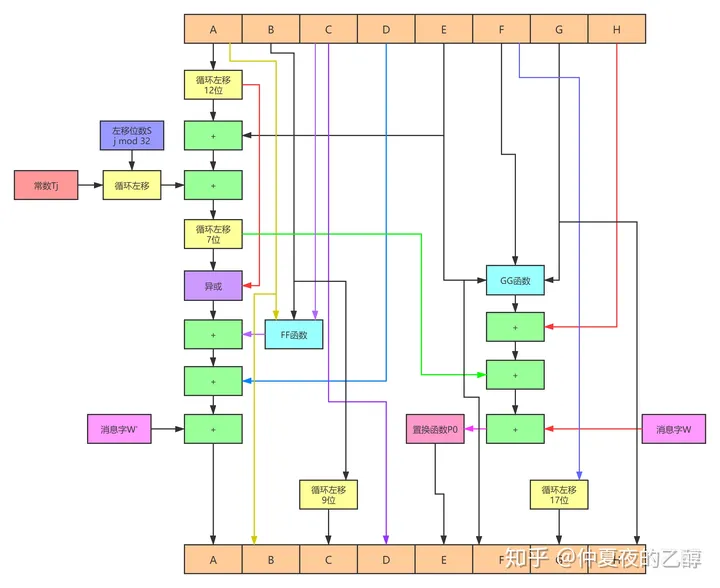
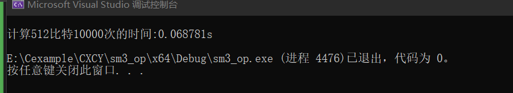
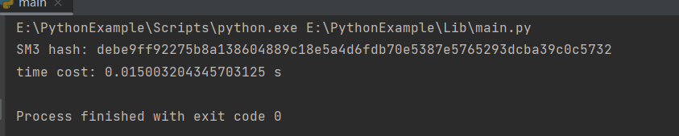

# project4
SM3密码杂凑算法是中国国家密码管理局2010年公布的中国商用密码杂凑算法标准。SM3适用于商用密码应用中的数字签名和验证，是在SHA-256基础上改进实现的一种算法，其安全性和SHA-256相当。SM3和MD5的迭代过程类似，也采用Merkle-Damgard结构。消息分组长度为512位，摘要值长度为256位。
整个算法的执行过程可以概括成四个步骤：消息填充、消息扩展、迭代压缩、输出结果。

# 消息填充
1、先填充一个“1”，后面加上k个“0”。其中k是满足(n+1+k) mod 512 = 448的最小正整数。  
2、追加64位的数据长度  
3、因为windows系统是使用小段存放数据的，因此最后我们需要将数据变为大端存储  
```cpp
void SM3_last(SM3* md, unsigned char hash[])
{
	int i;
	unsigned char tmp = 0;
	md->len += md->curlen << 3;
	md->buf[md->curlen] = 0x80;
	md->curlen++;
	if (md->curlen > 56)
	{
		for (; md->curlen < 64;)
		{
			md->buf[md->curlen] = 0;
			md->curlen++;
		}
		compress(md);
		md->curlen = 0;
	}
	for (; md->curlen < 56;)
	{
		md->buf[md->curlen] = 0;
		md->curlen++;
	}
	for (i = 56; i < 60; i++)
	{
		md->buf[i] = 0;
	}
	md->buf[63] = md->len & 0xff;
	md->buf[62] = (md->len >> 8) & 0xff;
	md->buf[61] = (md->len >> 16) & 0xff;
	md->buf[60] = (md->len >> 24) & 0xff;
	compress(md);
	memcpy(hash, md->state, 256 / 8);
	BigEndian(hash, 256 / 8, hash);
}
```

## 消息扩展
先将一个512位数据分组划分为16个消息字，并且作为生成的132个消息字的前16个。再用这16个消息字递推生成剩余的116个消息字。
```cpp
void ME(unsigned int B[], unsigned int W[], unsigned  int W1[])
{
	for (int i = 0; i < 16; i++)
		W[i] = B[i];
	for (int n = 16; n < 68; n++)
		W[n] = P2(W[n - 16] ^ W[n - 9] ^ Rleft(W[n - 3], 15)) ^ Rleft(W[n - 13], 7) ^ W[n - 6];
	for (int j = 0; j < 64; j++)
		W1[j] = W[j] ^ W[j + 4];
}
```

## 迭代压缩
经过一系列复杂的变化将，初始化的IV值改变，具体操作如下图：
  
具体代码如下：
```cpp
void CF(unsigned int W[], unsigned int W1[], unsigned V[])
{
	unsigned int A = V[0];
	unsigned int B = V[1];
	unsigned int C = V[2];
	unsigned int D = V[3];
	unsigned int E = V[4];
	unsigned int F = V[5];
	unsigned int G = V[6];
	unsigned int H = V[7];
	unsigned int SS1;
	unsigned int SS2;
	unsigned int TT1;
	unsigned int TT2;
	for (int i = 0; i < 64; i++)
	{
		if (i < 16)
		{
			SS1 = Rleft(Rleft(A, 12) + E + Rleft(T1, i), 7);
		}
		else
		{
			SS1 = Rleft(Rleft(A, 12) + E + Rleft(T2, i), 7);
		}
		SS2 = SS1 ^ Rleft(A, 12);
		if (i < 16)
		{
			TT1 = FF1(A, B, C) + D + SS2 + W1[i];
			TT2 = GG1(E, F, G) + H + SS1 + W[i];
		}
		else
		{
			TT1 = FF2(A, B, C) + D + SS2 + W1[i];
			TT2 = GG2(E, F, G) + H + SS1 + W[i];
		}
		D = C;
		C = Rleft(B, 9);
		B = A;
		A = TT1;
		H = G;
		G = Rleft(F, 19);
		F = E;
		E = P1(TT2);
	}
	V[0] = A ^ V[0];
	V[1] = B ^ V[1];
	V[2] = C ^ V[2];
	V[3] = D ^ V[3];
	V[4] = E ^ V[4];
	V[5] = F ^ V[5];
	V[6] = G ^ V[6];
	V[7] = H ^ V[7];
}
```
## 输出结果
在最终实现了SM3后，与在Python下调用库函数计算512比特的数据所用时间进行比对（重复计算10000次），可以看到我们实现的SM3所需要的时间与库函数执行时间相差无几，所得结果如下：
    
    
