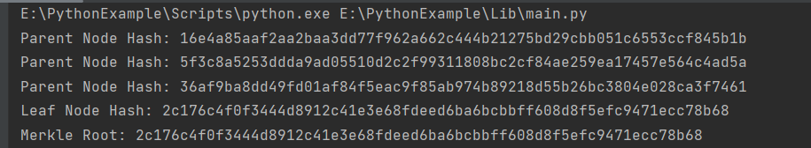

# project5
哈希树，在密码学及计算机科学中是一种树形数据结构，每个叶节点均以数据块的哈希作为标签，而除了叶节点以外的节点则以其子节点标签的加密哈希作为标签 。哈希树能够高效、安全地验证大型数据结构的内容，是哈希链的推广形式。哈希树中，哈希值的求取通常使用诸如SHA-2的加密哈希函数，但如果只是用于防止非故意的数据破坏，也可以使用不安全的校验和获取，比如CRC。哈希树的顶部为顶部哈希，可根据可信的顶部哈希对其进行校验，验证数据是否完整、是否遭受破坏。
  
## 代码实现
1、首先检查传入的数据块列表 data_blocks 是否为空，如果为空，则返回一个空树（空列表）。否则，我们继续处理数据块  
2、如果只有一个数据块，我们将其计算哈希值，并将其作为叶子节点返回  
3、对于多个数据块，我们按顺序对它们进行两两分组。对于每一对节点，我们计算出它们各自的哈希值，并将这两个哈希值连接后再次计算一个哈希值作为上层节点的哈希值    
4、最后，我们递归地调用 build_merkle_tree() 函数，以 parent_nodes 列表作为新的输入，继续构建 Merkle 树，直到最终只剩下一个根节点为止。
```python
def build_merkle_tree(data_blocks):
    # 如果数据块为空，返回空树
    if len(data_blocks) == 0:
        return []

    # 如果只有一个数据块，返回叶子节点
    if len(data_blocks) == 1:
        leaf_hash = calculate_hash(data_blocks[0])
        print("Leaf Node Hash:", leaf_hash)
        return [leaf_hash]

    # 构建上层节点
    parent_nodes = []
    for i in range(0, len(data_blocks), 2):
        node1 = calculate_hash(data_blocks[i])
        if i+1 < len(data_blocks):
            node2 = calculate_hash(data_blocks[i+1])
        else:
            node2 = node1
        parent_hash = calculate_hash(node1 + node2)
        print("Parent Node Hash:", parent_hash)
        parent_nodes.append(parent_hash)

    # 递归构建Merkle树
    return build_merkle_tree(parent_nodes)
```

#输出结果
将各个子节点哈希值及最后的顶部哈希的值输出如下：

