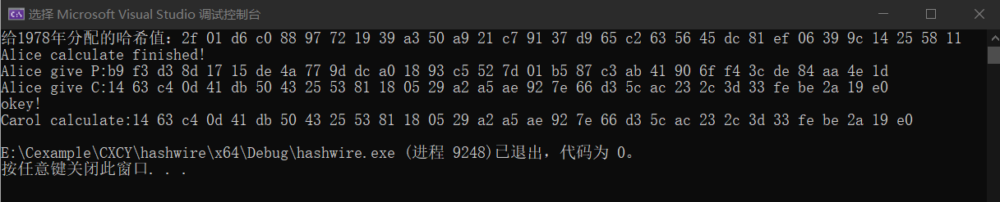

# project6
HashWires 的灵感来自 PayWord 协议，这是 Rivest 和 Shamir 于 1996 年提出的基于哈希链的小额支付协议。是完全基于哈希链计算的一种证明方法。
以我们的年龄示例，朴素的 PayWord 方法的工作原理如下：现在是 2021 年，Alice 想向 Carol 证明她至少 21 岁，而无需出示身份证或驾驶执照。 每个密码学家可能都知道，Alice 出生于 1978 年，当时 RSA 论文作者首次提到“对于我们的场景，我们假设 A 和 B（也称为 Alice 和 Bob）是公钥密码系统的两个用户”。 但我们暂时假设 Carol 不是密码学家，并且确实需要 Alice 超过 21 岁的证明； 他们也都信任政府颁发的证书。 此外，假设我们想在 2100 年之前使用这个证明系统。  
  
政府需要完成的工作如下：  
- 随机选择一个seed，通常至少 128 位长.
- 计算s=$`H_0`$(seed)并将其分配给 1978 年（爱丽丝的出生年份）
- 计算k=2100-1978作为从 1978 年到支持的最大年份 （2100） 的距离
- 计算c=$`H_1^k`$(s)作为承诺
- Alice得到s、$`sig_c`$、c.

认证时需要完成的工作如下：
- Alice计算d=2000-1978=22  
- Alice输出证明P=$`H_1^d`$  
- Carol计算$`d_1`$=2100-2000=100  
- Carol计算c=$`p^{d_1}`$,若相等则证明通过
 
具体流程如下图所示：


## 代码实现
```
void GOV(unsigned char s[],unsigned char p[],unsigned char c[])//GOV的计算 
{
	unsigned char temp[32];
	memcpy(temp, s,32);
	for (int i = 0; i < now - born; i++)
	{
		SM3_256(temp, 32, p);
		memcpy(temp, p, 32);
	}
	printf("Alice calculate finished!\n");
	memcpy(temp, s, 32);
	for (int i = 0; i < max - born; i++)
	{
		SM3_256(temp, 32, c);
		memcpy(temp, c, 32);
	}
}
```

```
void Carol(unsigned char p[],unsigned char c[])//Carol的计算
{
	for (int i = 0; i < max - now; i++)
	{
		SM3_256(p, 32, p);
	}
	if (!memcmp(p, c, 32))
		printf("okey!\n");
	else
		printf("no!\n");
}
```

## 运行结果
这里实现时仅模拟了关键步骤，省去了签名部分，使用SM3进行哈希计算，具体结果如下图：
  
