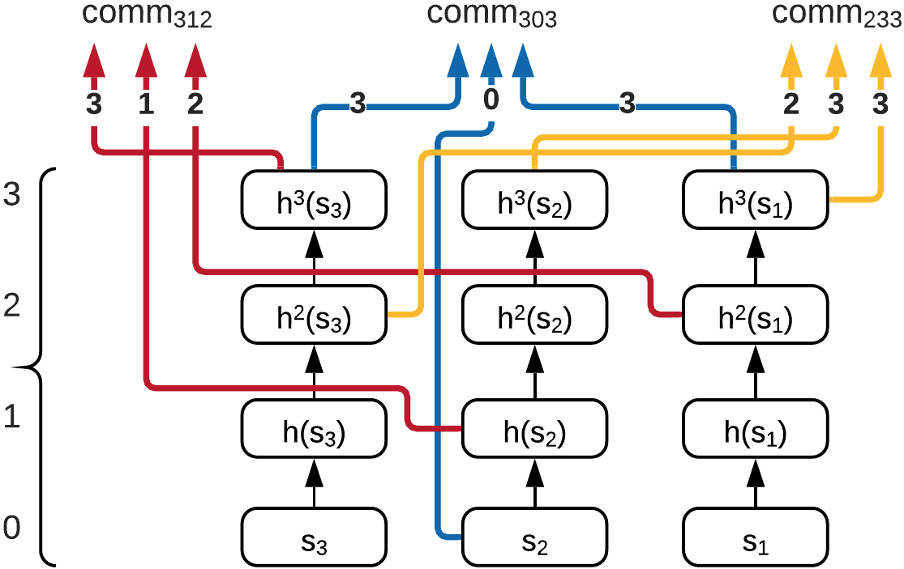

# project7

## Generalizing Hashchains（泛化哈希链）
我们可以基于发行的数字，创建多条哈希链，每个哈希链的长度由对应位置上的数字所决定，结构如下：  
  
其中发行数字为03999，则低三位的哈希链长度为9+1=10，第二位的哈希链长度为3+1=4，第一位的长度为0+1=1，若想证明承诺大于等于1492，则我们只需要给出图中标黄的哈希值即可。  

但是这样的结构有所缺陷吗，对于发行数字为03997，因为最后一位为7，哈希链长度为8，所以最后一位是8，9的数字无法提供证明。  


因此我们使用重用链的方案对其进行优化，为发行的集合中的每个数都创建一个多哈希链，根据数字选择最接近的哈希链进行证明。  
  
并使用填充节点的默克树对信息进行隐藏。  


最终实现的方案结构如下：


## 代码实现
```python
#shuffle的操作
def shuffle(a,b,c):
    #加盐
    salt1 = andom_hex(256)
    salt2 = andom_hex(256)
    salt3 = andom_hex(256)
    temp1 = sm3(salt1 + a)
    temp2 = sm3(salt2 + b)
    temp3 = sm3(salt3 + c)
    seed_D=andom_hex(256)
    shuffle_seed = andom_hex ( 256 )
    for i in range(9):
        seed_D=sm3(seed_D)
    lst=[]
    #padding
    for i in range(15):
        lst.append(andom_hex(256))
    lst[1] = temp1
    lst[2] = temp2
    lst[8] = temp3
    lst[9] =seed_D
    build_merkle_tree ( lst )


#哈希链的创建
def hashChain(a,b,c):
    #a,b,c是发行的数字
    a1=int(a%10)
    a2=int((a%100)/10)
    a3=int(a/100)
    b1=int(b%10)
    b2=int((b%100)/10)
    b3=int(b/1000)
    c1=int(c%10)
    c2=int((c%100)/10)
    c3=int(c/1000)
    #生成哈希链
    s1 = andom_hex(256)
    s2 =  andom_hex(256)
    s3 =  andom_hex(256)
    s1_chain=chain(s1)
    s2_chain=chain(s2)
    s3_chain=chain(s3)
    temp1=s1_chain[3]+s2_chain[1]+s3_chain[2]
    temp2=s1_chain[3]+s2_chain[0]+s3_chain[3]
    temp3=s1_chain[2]+s2_chain[3]+s3_chain[3]
    temp1=sm3(temp1)
    temp2=sm3(temp2)
    temp3=sm3(temp3)
    return temp1,temp2,temp3

```

## 运行结果

