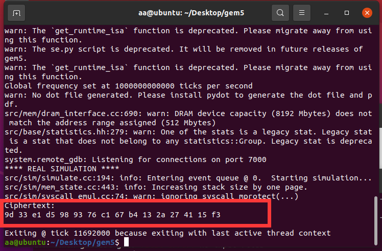

# project8
## AES简介
AES又称Rijndael加密法，是美国联邦政府采用的一种区块加密标准。这个标准用来替代原先的DES，已经被多方分析且广为全世界所使用。经过五年的甄选流程，高级加密标准由美国国家标准与技术研究院（NIST）于2001年11月26日发布于FIPS PUB 197，并在2002年5月26日成为有效的标准。现在，高级加密标准已然成为对称密钥加密中最流行的算法之一。  
算法主要包括四个步骤：
- AddRoundKey(轮密钥加)
  每个字节与轮密钥的对应字节进行异或运算  

- SubBytes(S盒替换)
  根据S盒对每个字节进行替换，唯一非线性部件16个字节采用相同的S盒。  

- ShiftRows(行移位)
  第0行不动，第一行循环左移1个字节，第二行循环左移2个字节，第三行循环左移3个字节。  

- MixColumn(列混淆)
  将明文每一列与特定的矩阵做字节乘法，在有限域GF($`2^8`$)下进行。  


## 指令集简介
高级加密标准指令集（或称英特尔高级加密标准新指令，简称AES-NI）是一个x86指令集架构的扩展，用于Intel和AMD微处理器，由Intel在2008年3月提出。该指令集的目的是改进应用程序使用高级加密标准（AES）执行加密和解密的速度。在项目中，因为是在ARM架构下实现，所以我们需要使用ARM NEON指令集。ARM NEON指令集是针对ARM架构的一组SIMD（Single Instruction, Multiple Data）指令，用于高效地执行并行数据处理任务。NEON指令集主要用于图像、音频、视频处理等领域，以及其他需要同时处理多个数据元素的应用。

## 代码实现
因为本次实验是在ARM架构下实现，因此我们若想得到运算结果，需要在gem5模拟器下对c文件进行交叉编译，并在gem5下运行ARM架构的文件。代码如下：  
```c
void aes_encrypt(const uint8_t* plaintext, const uint8_t* key, uint8_t* ciphertext) {
    uint8x16_t m = vld1q_u8(plaintext);
    uint8x16_t k = vld1q_u8(key);

    m = vaeseq_u8(m, k);
    m = vaesmcq_u8(m);
    m = vaeseq_u8(m, k);
    m = vaesmcq_u8(m);
    m = vaeseq_u8(m, k);
    m = vaesmcq_u8(m);
    m = vaeseq_u8(m, k);
    m = vaesmcq_u8(m);
    m = vaeseq_u8(m, k);
    m = vaesmcq_u8(m);
    m = vaeseq_u8(m, k);
    m = vaesmcq_u8(m);
    m = vaeseq_u8(m, k);
    m = vaesmcq_u8(m);
    m = vaeseq_u8(m, k);

    vst1q_u8(ciphertext, m);
}
```

## 运行结果
可以看到，AES正确运行并输出结果。(源文件及可执行文件已上传)
  

