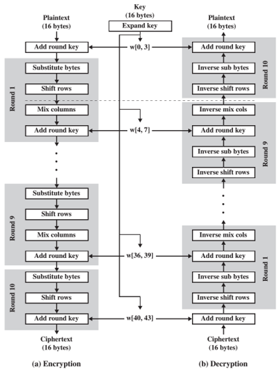
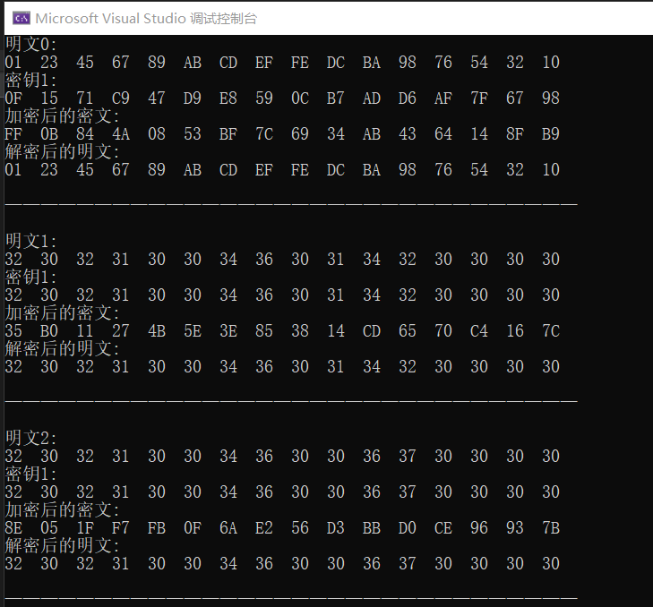
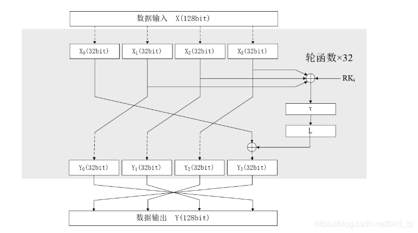
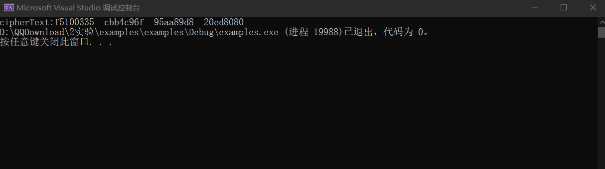

# project9
## AES实现
AES在此不再介绍，具体实现结构如下：  


## 代码实现
```c
void MyAES(unsigned char* plaintext, unsigned char* key, unsigned char* ciphertext)//128-bit
{
	//初始置换
	for (int i = 0; i < 16; i++)
	{
		*(ciphertext + i) = *(plaintext + i) ^ *(key + i);
	}
	//9轮变换
	for (int i = 0; i < 9; i++)
	{
		SubByte(ciphertext, 0);
		Shift(ciphertext);
		Mixcolumn(ciphertext, &MixC[0]);
		KeyExpand(key, i, 0);
		Add(ciphertext, key);
	}
	SubByte(ciphertext, 0);
	Shift(ciphertext);
	KeyExpand(key, 9, 0);
	Add(ciphertext, key);
}
```

## AES运行结果
分别对三组明文加解密，结果如下：  


## SM4实现

SM4是中华人民共和国政府采用的一种分组密码标准，由国家密码管理局于2012年3月21日发布，相关标准为“GM/T 0002-2012《SM4分组密码算法》（原SMS4分组密码算法）”。2016年8月，成为中国国家密码标准（GB/T 32907-2016）。SM4主要用于数据加密，其算法公开，分组长度与密钥长度均为128bit，加密算法与密钥扩展算法都采用32轮非线性迭代结构，S盒为固定的8比特输入8比特输出。
主要加密过程分为两步：
- 32轮迭代变换
- 1次反序变换  
主要结构如下图所示：  


## 代码实现
```c
void enc(uint32_t ciphertext[4], uint32_t context[4],uint32_t key[32])
{
	uint32_t X[5];
	for (int n = 0; n < 4; n++)
	{
		X[n]=context[n];
	}
	for (int i = 0; i < 32; i++)
	{
		X[(i + 4)%5] = F(X[i%5], X[(i + 1)%5], X[(i + 2)%5], X[(i + 3)%5], key[i]);
	}
	ciphertext[0] = X[0];
	ciphertext[1] = X[4];
	ciphertext[2] = X[3];
	ciphertext[3] = X[2];
}
```

## 输出结果
对给定明文输出加密结果如下图所示：  

